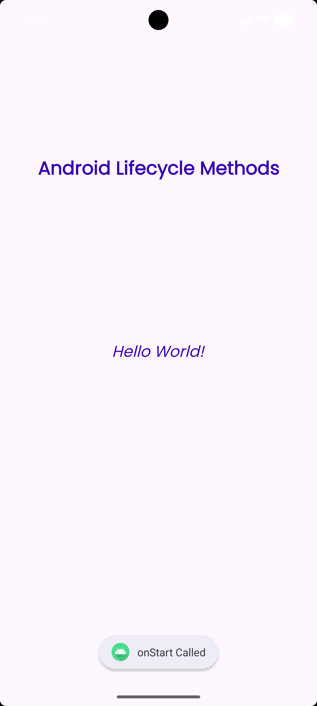
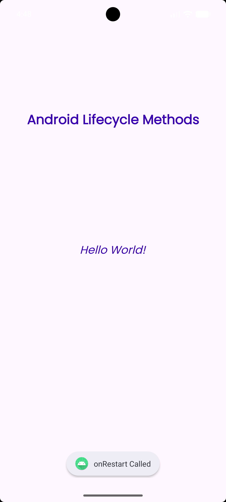
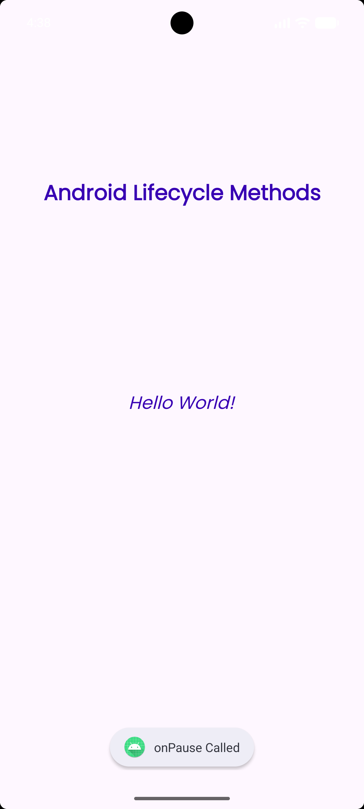
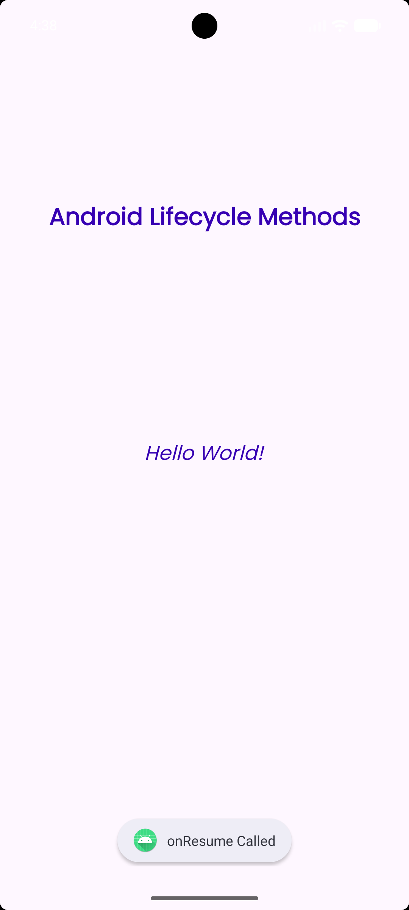

# Ex.No:2 To create a HelloWorld Activity using all lifecycles methods to display messages.

## AIM:

To create a HelloWorld Activity using all lifecycles methods to display messages using Android Studio.

## EQUIPMENTS REQUIRED:

Latest Version Android Studio

## ALGORITHM:

Step 1: Open Android Stdio and then click on File -> New -> New project.

Step 2: Then type the Application name as HelloWorld and click Next.

Step 3: Then select the Minimum SDK as shown below and click Next.

Step 4: Then select the Empty Activity and click Next. Finally click Finish.

Step 5: Design layout in activity_main.xml.

Step 6: Display message give in MainActivity file.

Step 7: Save and run the application.

## PROGRAM:

```java
/*
Program to print the text “Hello World”.
Developed by: Roopak C S
Registeration Number: 212223220088
*/

package com.example.lifecyclemethods;

import android.os.Bundle;
import android.widget.Toast;

import androidx.appcompat.app.AppCompatActivity;

public class MainActivity extends AppCompatActivity {

    @Override
    protected void onCreate(Bundle savedInstanceState) {
        super.onCreate(savedInstanceState);
        setContentView(R.layout.activity_main);
        Toast toast = Toast.makeText(getApplicationContext(), "onCreate Called", Toast.LENGTH_LONG);
        toast.show();
    }

    protected void onStart() {
        super.onStart();
        Toast toast = Toast.makeText(getApplicationContext(), "onStart Called", Toast.LENGTH_LONG);
        toast.show();
    }

    @Override
    protected void onRestart() {
        super.onRestart();
        Toast toast = Toast.makeText(getApplicationContext(), "onRestart Called", Toast.LENGTH_LONG);
        toast.show();
    }

    protected void onPause() {
        super.onPause();
        Toast toast = Toast.makeText(getApplicationContext(), "onPause Called", Toast.LENGTH_LONG);
        toast.show();
    }

    protected void onResume() {
        super.onResume();
        Toast toast = Toast.makeText(getApplicationContext(), "onResume Called", Toast.LENGTH_LONG);
        toast.show();
    }

    protected void onStop() {
        super.onStop();
        Toast toast = Toast.makeText(getApplicationContext(), "onStop Called", Toast.LENGTH_LONG);
        toast.show();
    }

    protected void onDestroy() {
        super.onDestroy();
        Toast toast = Toast.makeText(getApplicationContext(), "onDestroy Called", Toast.LENGTH_LONG);
        toast.show();
    }

}
```

## OUTPUT

### onCreate()


### onStart()



### onRestart()



### onPause()



### onResume()



## RESULT

Thus a Simple Android Application create a HelloWorld Activity using all lifecycles methods to display messages using Android Studio is developed and executed successfully.
